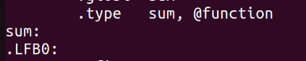
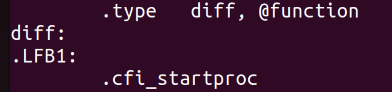
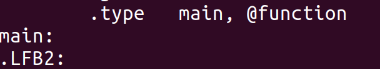
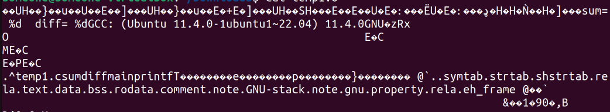
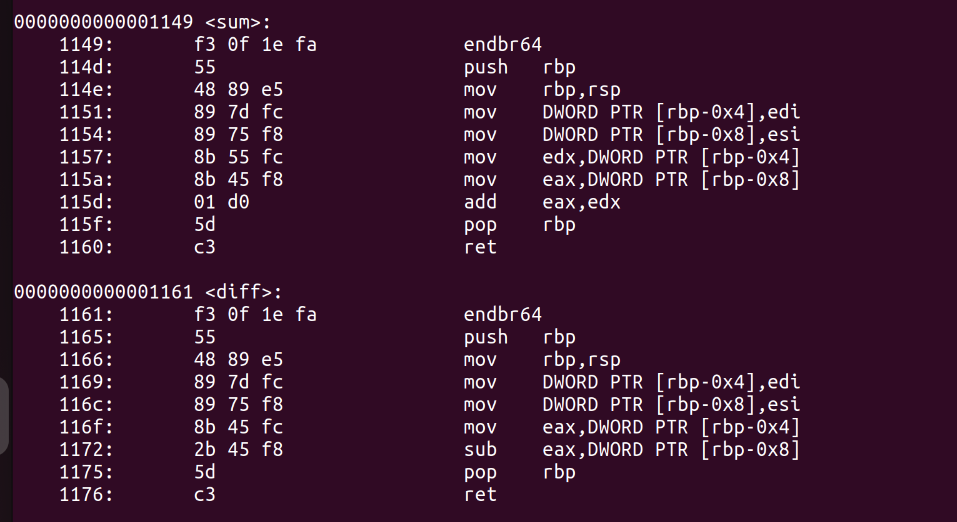
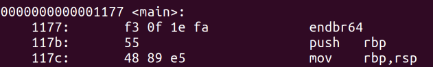
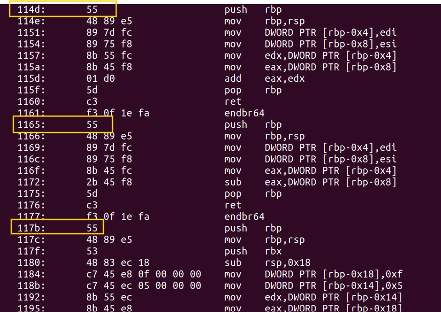

# <span style="color:#004F98;">**Chapter 1:**</span>

## 1. Locating Functions

 <span style="color:#004F98;">**Q :**</span>
 Write a C program that contains several functions and compile it into
 an assembly file, an object file, and an executable binary, respectively.
 Try to locate the functions you wrote in the assembly file and in the
 disassembled object file and executable. Can you see the correspon
dence between the C code and the assembly code? Finally, strip the
 executable and try to identify the functions again.

 <span style="color:#004F98;">**Answer :**</span>
 
 <a id="temp1"></a> 

* To do that, I wrote this simple C program that contain 3-functions *(Sum, Diff, Print)*

    ```C
    #include <stdio.h>

    int sum(int A , int B){
        return A+B;
    }

    int diff(int A , int B){
        return A-B;
    } 

    int main() {

        int X = 15, Y = 5;
        printf("sum= %d  diff= %d" ,sum(X,Y) ,diff(X,Y));

        return 0;
    }
    ```

* Let's compile it into assembly first, run these commands:

    ```
    gcc -S temp1.c
    cat temp1.s
    ```
    **Now,** we can see our 3-functions being assembled
    
    
    
    

* **Second,** Let's get the object file:
    ```
    gcc -c temp1.c
    cat temp1.o
    ```
    The output of the object file is absloutly non-human readable
    

* To get the full combiled binary run:
    ```
    gcc temp1.c -o temp1.out
    objdump -M intel -S temp1.out
    ```
    We can see now our 3-functions
     

* **Finially,** Let's strip our binary:
    ```
    strip --strip-all a.out
    objdump -M intel -S temp1.out
    ```
    Now, we see that our 3-functions do not have there symbolic names:
    
    ---


 ## 2. Sections

  <span style="color:#004F98;">**Q :**</span>
 As you’ve seen, ELF binaries (and other types of binaries) are divided
 into sections. Some sections contain code, and others contain data.
 Why doyou think the distinction between code and data sections
 exists? How do you think the loading process differs for code and
 data sections? Is it necessary to copy all sections into memory when a
 binary is loaded for execution?

 <span style="color:#004F98;">**Answer :**</span>

 * **At first,** code and data aren't mixed into one section for security purposes, allowing write attribute in code will enable attackers to inject malicious code into our code

* **Second,** code sections are executable and properly aligned for efficient instruction fetching, while data sections are loaded with appropriate permissions and initial values as specified by the executable file.
* **Third,** it's not necessarily to copy all sections into memory will loading, sections that may not be used, When an ELF binary is loaded, the loader reads the ELF headers to determine the layout of the needed sections in the binary and maps them into memory accordingly.
___
