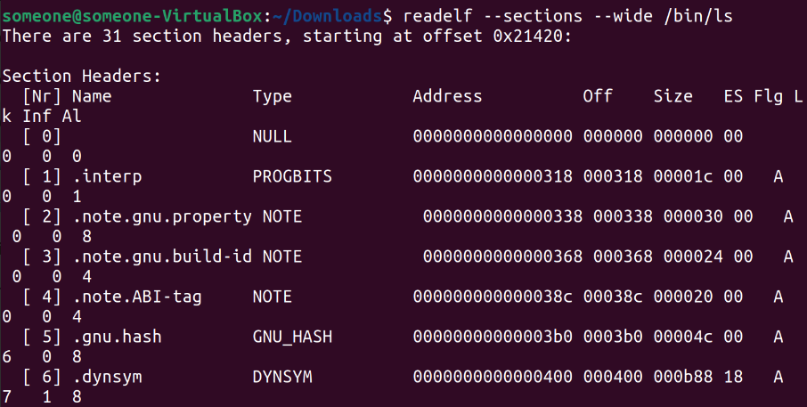

# <span style="color:#004F98;">**Chapter 2:**</span>

 ## 1. Manual Header Inspection

 <span style="color:#004F98;">**Q :**</span>
 Use a hex viewer such as xxd to view the bytes in an ELF binary in
 hexadecimal format. For example, you can use the command xxd
 /bin/ls | head-n 30 to view the first 30 lines of bytes for the /bin/ls
 program. Can you identify the bytes representing the ELF header?
 Try to find all of the ELF header fields in the xxd output and see
 whether the contents of those fields make sense to you.

<span style="color:#004F98;">**Answer :**</span>


**We will run this command:**
```
xxd /bin/ls | head-n 30
```


we can now see the first 30 lines which contain:
*  Executable header's 4-bytes at (1)
* Start of program header at (2)
    ___

## 2. Sections and Segments

 <span style="color:#004F98;">**Q :**</span>
 Use readelf to view the sections and segments in an ELF binary. How
 are the sections mapped into segments? Make an illustration of the
 binary’s on-disk representation versus its representation in memory.
 What are the major differences?

 <span style="color:#004F98;">**Answer :**</span>

**We will run this command one by one :**
```
readelf --sections --wide /bin/ls
readelf --segments --wide /bin/ls
```
* The first line will show us the full (31) sections that exist in the binary.



* The second one will show us the segments along with how they are mapped to sections in memory


* The Major Difference is:
    * On-disk representation organizes the binary into sections, which contain specific types of data or code.
    * In memory, the binary is organized into segments, which define the memory layout and contain one or more sections. Segments are what the operating system loads into memory.
$~$
    ___

 ## 3. C and C++ Binaries
  <span style="color:#004F98;">**Q :**</span>
Use readelf to disassemble two binaries, namely a binary produced
 from C source and one produced from C++ source. What differences
 are there?

 <span style="color:#004F98;">**Answer :**</span>

To do that, I used our  previous C code [temp1.c](#temp1), along with another c++ version of it [temp2.cpp](#temp2) :


 <a id="temp2"></a> 

```cpp
#include <iostream>

int sum(int A, int B) {
    return A + B;
}

int diff(int A, int B) {
    return A - B;
}

int main() {
    int X = 15, Y = 5;
    std::cout << "sum= " << sum(X, Y) << "  diff= " << diff(X, Y);
    return 0;
}
```

**run those commands :**

```
gcc temp1.c -o temp1.out
g++ temp2.cpp -o temp2.out
readelf -s temp1.out > c.txt
realelf -s temp2.out > cpp.txt
```
Now you will see a 2 text files contain the disassembly of both codes, The main obvious diffrence is the naming
* In C binaries, symbol names typically match the function and variable names directly from the source code.
* In C++ binaries, due to name mangling, symbol names may be decorated to include information about namespaces, classes, function signatures, and other type information. 
    ___

## 4. Lazy Binding
 
  <span style="color:#004F98;">**Q :**</span>
Use objdump to disassemble the PLT section of an ELF binary.
 Which GOT entries do the PLT stubs use? Now view the contents
 of those GOT entries (again with objdump) and analyze their relation
ship with the PLT.

<span style="color:#004F98;">**Answer :**</span>

First, let's run our needed commands:
```
objdump -M intel --section .plt -d temp1.out
objdump -M intel --section .got -d temp1.out
```
This is our output:


**Now, how  does this works?**

* The "puts@plt" stub begins with an indirect jump instruction, which jumps to an address stored in the .got.plt section.
*  The next instruction jumps to the common default stub
 shared among all PLT function stubs.
*  then jumps (indirectly, through the GOT) to the
 dynamic linker.

___

