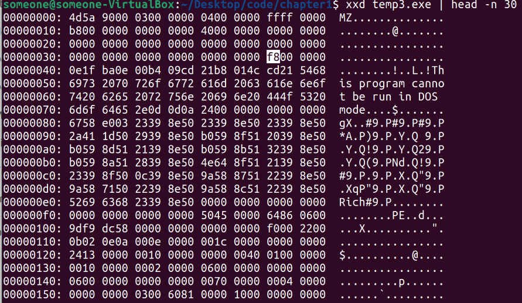

# <span style="color:#004F98;">**Chapter 3:**</span>

## 1. Manual Header Inspection

<span style="color:#004F98;">**Q :**</span>
  Just as you did for ELF binaries in Chapter 2, use a hex viewer like xxd to view the bytes in a PE binary. You can use the same command as before, ***"xxd program.exe | head-n 30"***, where program.exe is your PE binary. Can you identify the bytes representing the PE header and make sense of all of the header fields?

<span style="color:#004F98;">**Answer :**</span>

* Lets run our command:
    ```
    xxd temp3.exe | head-n 30
    ```
* Now, this is our output, We can the the ***"e_lfanew"*** pointer which tells us the offset of the PE header at **"0xf8"**.

    

* To make it more human-readable we can use:
    ```
    objdump -x hello.exe
    ```
* Now we can read and analyze it more easily.

    
    ---

## 2. Disk Representation vs. Memory Representation
 
<span style="color:#004F98;">**Q :**</span>
Use readelf to view the contents of a PE binary. Then make an illustra
tion of the binary’s on-disk representation versus its representation in memory. What are the major differences?

 <span style="color:#004F98;">**Answer :**</span>

* First, *readelf* is a tool specifically designed to analyze ELF files. For PE files we could use *readpe* or *objdump* with the *-x* option.
* Second, as we read in the book, Unlike ELF, the PE format does not explicitly distinguish between sections and segments. The closest thing PE files have to ELF’s execution view is the DataDirectory, which provides the loader with a shortcut to certain portions of the binary needed for setting up the execution. Other than that, there is no separate program header table; the section header table is used for both linking and loading.
___